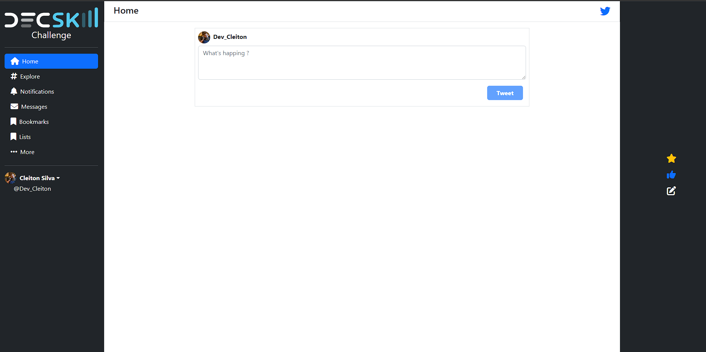
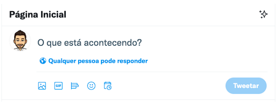
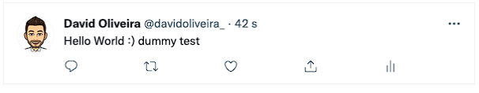

<p align="center">
  Este é um desafio de código para avaliar as tuas habilidades em @angular.
  Deverás conseguir terminar esta tarefa em menos de 1 dias. Se desejares,
  podes usar o Bootstrap para ajudar no composição do layout.
</p>

<br>

<p align="center">
  
</p>

## O DESAFIO
Aplicação front-end Pleno para Empresa Decskill

O desafio consiste em criar uma página composta por uma timeline com posts
e a possibilidade de adicionar e remover posts, semelhante ao Twitter. Os
posts deverão ficar guardados no localStorage do browser.

A aplicação ao arrancar deverá ser composta por uma zona que ficará sempre
no topo para que o utilizador possa escrever e adicionar posts. O número
máximo de carateres possíveis num post deverá ser 130 e conforme o
utilizador vai escrevendo deverá aparecer junto ao botão de submissão o
número de carateres restantes possíveis até chegar a zero e o utilizador
deverá ser impedido de continuar a escrever.

<br>

<p align="center">
  
</p>

<br>

Conforme o utilizador escreve e adiciona posts, eles vão sendo
adicionados à timeline imediatamente abaixo:

<br>

<p align="center">
  
</p>

<br>

O utilizador deverá também conseguir remover o post através de um ícone
de remoção com pergunta de confirmação ao utilizador.

<br>

Opcional: Conforme o tempo decorrido do tweet, a label do timestamp
deverá ser atualizado em tempo real com 2 cenários:

* Segundos passados
* Após 1 minuto, apresentar data e hora

<p align="center">
  
</p>

<br>

As imagens acima são sugestivas (fonte Twitter), 

<br>


## REQUISITOS
Deve-se criar uma página que atenda os seguintes requisitos:
* Criar posts com controlo dos carateres escritos
* Remover posts com pergunta de confirmação
* Os posts deverão ser guardados no localStorage do browser para que
não se percam num refresh e assim, a timeline os apresente
* Opcional: tempo decorrido do post
Leva o tempo necessário para completar a tarefa. Durante o processo,
estamos disponíveis para esclarecer qualquer dúvida, estamos aqui para
ajudar. Se houver alguma funcionalidade que não consigas concluir,
Bom trabalho!

## TECNOLOGIAS
Esse projeto foi desenvolvido com as seguintes tecnologias:
- **Angular 13** 
- **Typescript** 
- **Bootstrap** 

## 🤔 Como executar o projeto
```bash
# Clone este repositório
$ git clone https://github.com/cleitonosilva/challenge_Twitter

# Acesse a pasta do projeto no seu terminal
$ cd challenge_Twitter

# Instale as dependências
$ npm install

# Execute a aplicação 
$ ng s
```

---
<p align="center">by Cleiton Oliveira</p>
